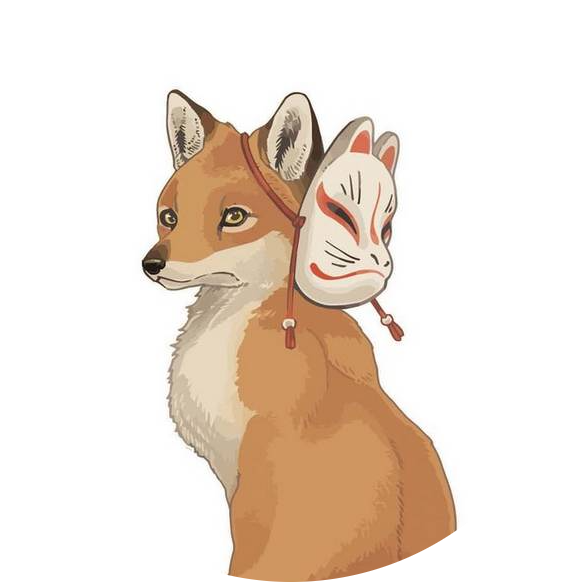

<h1 align="center">Hi 👋, I'm Bryson Tai</h1>
<h3 align="center">DevOps Engineer | Cloud & Automation Enthusiast | AI Learner </h3>

 

<i>"Automate everything, learn every day, and help others grow."</i>

---

### 🚀 **About Me**

 

- DevOps Engineer passionate about automation, cloud, and modern infrastructure.
- Well-versed in DevOps tools and practices, with hands-on experience in CI/CD, IaC, and container orchestration.
- Advocate for DevSecOps, GitOps, and strong troubleshooting.
- Eager to learn and adapt to new technologies, including AIOps and AI integration in DevOps.

---

### 🛠️ My DevOps Tech Stack

              

- **Cloud:** Azure, AWS
- **OS:** Linux
- **IaC:** Terraform, OpenTofu
- **CI/CD:** Azure DevOps, GitLab CI, GitHub Action
- **Containers:** Docker, Kubernetes
- **GitOps:** ArgoCD
- **Languages:** Go, Python, Bash
- **Security**: SAST, DAST, Container Security
- **Monitoring & Logging:** Datadog, Prometheus, Grafana, ELK
- **AI**: MCP Servers Development, Agent2Agent (A2A) Protocol

---

### 📂 Featured Public Projects

- [Azure Networking](https://github.com/Bryson-Tai/Azure_Networking):
 *Learned Azure Networking services using Terraform and OpenTofu.*
- [Azure DevOps Golang Project](https://dev.azure.com/bryson9149/bryson_ado_demo/_git/golang_project_deployment):
 *Full CI/CD for deploying a Go App using Azure DevOps pipelines.*
- [GitLab Golang Project - Deployment](https://gitlab.com/Bryson-Tai/golang_project_deployment):
 *Go App deployment to AKS and ACR via GitLab CI.*
- [GitLab Golang Project - Infrastructure](https://gitlab.com/Bryson-Tai/golang_project_infra):
 *Provision AKS and ACR through GitLab CI using OpenTofu.*

---

### 📫 Connect With Me

- [LinkedIn](https://www.linkedin.com/in/bryson-tai-531453235/)
- [GitHub](https://github.com/Bryson-Tai)
- [Email](mailto:brysontai1314@gmail.com)
- [Personal Website](https://bryson-tai.github.io/Bryson-Tai/)

---

### 🍳 Fun Fact

- I was a chef previously! Good food = happy life. 🍣 🍜 🍰 🍺
- I am a cat person! 🐱
